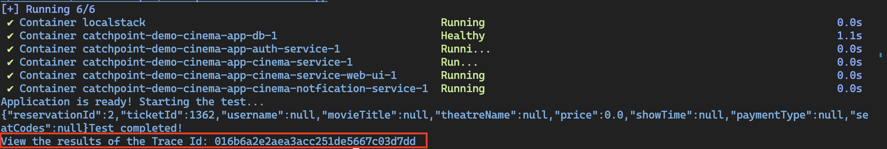

# Catchpoint Demo Cinema App

This is a demo cinema app a basic example of a cinema booking system. You can display a list of movies, view movie
details, and book tickets for a movie.

## Pre-requisites

- Docker (https://docs.docker.com/get-docker/)
- Docker Compose (https://docs.docker.com/compose/install/)
- JQ (https://jqlang.github.io/jq/download/)
- cURL (https://curl.se/download.html)
- Maven (https://maven.apache.org/download.cgi)
- **[Windows]** Powershell (https://docs.microsoft.com/en-us/powershell/scripting/install/installing-powershell)

## Setting up Catchpoint API Key

1. Retrieve your api key from Catchpoint Portal
2. Change `<API_KEY>` value from the
    - For **OpenTelemetry** agent:
        - `backend/auth-service/otel-trace/otel-config.properties`
        - `backend/cinema-service/otel-trace/otel-config.properties`
        - `backend/notification-service/otel-trace/otel-config.properties`

3. **[Optional]** If you want to customize each service name, change the
   - For **OpenTelemetry** agent `otel.service.name`

    in the above files to a unique name for each service

## Getting Started - Manual Installation

1. Clone the repository
2. Install _opentelemetry agent_
- **For Windows**
  ```bash
  ./otel.ps1
  ```
- **For Linux/Mac**
  ```bash
  ./otel.sh
  ```
3. Run the following command to start the application
```bash
docker-compose up
``` 
4. Open [Web UI](http://localhost:3000/login) in your browser to access the cinema app

## Getting Started - Automated Installation

1. Clone the repository
2. Run the following command to start the application
- **For Windows**
    ```bash
    ./start.ps1
    ```
- **For Linux/Mac**
    ```bash
    ./start.sh
    ```

3. Click go to the trace link of the given trace id
   

## Accessing the Application

- Open your browser and navigate to [Login Page](http://localhost:3000/login) to access the cinema app
- Click on the `Login` button to login to the application
- Then you can view the list of movies, view movie details, and book tickets for a movie
- You can also view the booking history by clicking on the [Reservation](http://localhost:3000/reservations) link
